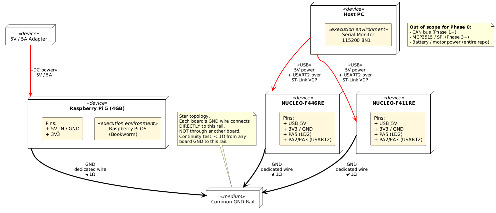
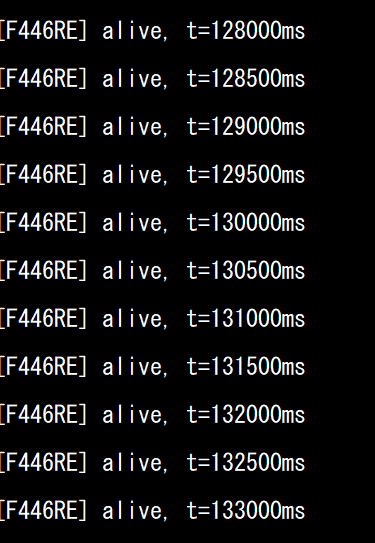

# multi-mcu-can: CAN 2.0 다중 MCU 분산 통신


STM32 보드 두 개와 Raspberry Pi 5를 연결하는 **CAN 2.0 다중 노드 통신** 집중 학습 프로젝트. actuator도, 섀시도, 애플리케이션 로직도 없다 — 버스와 프로토콜, 그리고 분산 MCU를 안정적으로 통신시키기 위해 필요한 규율에만 집중한다.

이 repository는 **[Neuro-Drive](https://github.com/steppenhj/neuro-drive)** 의 후속 프로젝트로, 원래 Phase 6에 해당하는 내용을 분리한 것이다. actuator 레이어를 걷어내고 기초에 집중하기 위해 별도 repository로 추출했다.

---

## 별도 repository를 만든 이유

부모 프로젝트에서 F446RE 마이그레이션 중 하드웨어 사고가 발생했다: 서보가 stall했고, GND 점퍼 선에 불이 붙었으며, L298N 드라이버가 서보와 함께 망가졌다. 원인은 코드가 아니었다 — 하위 레이어를 변경한 후에도 이전에 정상 작동하던 하드웨어가 여전히 정상일 것이라는 가정이 문제였다.

이 repository는 처음에 빠뜨렸던 규율을 중심으로 구성된다: **다음 레이어를 추가하기 전에 현재 레이어를 반드시 검증한다.**

---

## 운영 원칙

이 repository의 모든 Phase에서 타협 불가능한 4가지 규칙.

1. **코드를 의심하기 전에 전원과 GND를 먼저 확인한다.** 멀티미터 점검은 30초면 된다; 보드가 타면 며칠이 날아간다.
2. **기대하는 동작 없이 비정상적인 소리나 열이 발생하면 즉시 전원을 차단한다.** 재인가 전에 원인을 파악한다. Stall된 모터와 서보는 조용한 킬러다 — 조용하지 않게 되기 전까지는.
3. **한 번에 하나의 레이어만 추가한다.** 새로운 레이어 두 개를 동시에 디버깅하지 않는다. 버스가 새 것이라면 펌웨어는 검증된 것을 쓴다. 펌웨어가 새 것이라면 버스는 이미 검증된 상태여야 한다.
4. **Known-good 백업을 유지한다. 마이그레이션 전에는 반드시 브랜치를 만든다.** "문제가 생기면 되돌리면 된다"는 말은, 되돌아갈 대상이 실제로 깨끗할 때만 통한다.

---

## 아키텍처

단일 CAN 2.0 버스에 세 노드, 500 kbps, 양쪽 물리적 끝단에 120Ω 종단 저항.

### Phase 0 — 배포 토폴로지 (전원 & GND만)



```
                       CAN_H ────────────────────────────────────
                                  │             │              │
                       CAN_L ─────┼─────────────┼──────────────┼──
                                  │             │              │
                            ┌─────┴────┐  ┌─────┴────┐  ┌──────┴──────┐
                            │ MCP2551  │  │ TJA1050  │  │   MCP2551   │
                            │  (xcvr)  │  │  (xcvr)  │  │   (xcvr)    │
                            └─────┬────┘  └─────┬────┘  └──────┬──────┘
                                  │             │              │
                            ┌─────┴────┐  ┌─────┴────┐  ┌──────┴──────┐
                            │ F446RE   │  │ MCP2515  │  │  F411RE     │
                            │  bxCAN   │  │  (SPI)   │  │   bxCAN     │
                            └──────────┘  └─────┬────┘  └─────────────┘
                                                │
                                          ┌─────┴────┐
                                          │  RPi 5   │
                                          │SocketCAN │
                                          └──────────┘
```

**노드 역할** (의도적으로 추상화 — 아직 actuator 없음):
- **F446RE** — 미래 MotorECU placeholder. 현재는 주기적 status broadcaster.
- **F411RE** — 미래 SensorECU placeholder. 현재는 주기적 data broadcaster.
- **RPi 5** — gateway, logger, diagnostic master. MCP2515 + TJA1050 SPI 연결.

---

## Phase 계획

각 Phase는 **독립적으로 빌드 가능하고, 회귀 테스트가 가능한** 산출물을 만든다. 이후 Phase가 실패해도 이전 Phase를 실행할 수 있어야 한다.

| Phase | 목표 | 검증 방법 | 노드 수 |
|:-----:|------|-----------|:-------:|
| **0** | 전원 & GND 검증, 기본 동작 확인 | 멀티미터 측정값 기록, 각 보드에서 "I'm alive" UART 출력 | 3개 독립 |
| **1** | F446RE bxCAN internal loopback | TX/RX 카운터가 UART 모니터에서 동기적으로 증가 | 1 |
| **2** | F446RE ↔ F411RE 직접 2노드 CAN (MCP2515 없음) | LED 미러링: 한 노드의 버튼 → 다른 노드의 LED, 50ms 이내 | 2 |
| **3** | + RPi5 (MCP2515) 버스 참여 | `candump can0`에서 올바른 ID와 DLC로 두 STM32 메시지 확인 | 3 |
| **4** | 주기적 + 이벤트 기반 메시지 스케줄링, 우선순위 처리 | 버스 로그 분석: 주기 메시지 jitter < 5ms, priority inversion 없음 | 3 |
| **5** | 오류 처리, bus-off 복구, 진단 교환 (UDS 스타일) | 의도적 케이블 분리/재연결 시나리오; 노드가 1초 이내 복구 | 3 |

### Phase 0를 별도로 두는 이유

부모 프로젝트의 사고는 정상 작동하는 차에서 시작해 서보 화재로 끝났다. 아무도 확인하지 않던 레이어를 통해 결함이 전파됐다. 이 repository는 Phase 0 sign-off 전까지 Phase 1을 시작하지 않는다 — 모든 보드가 깨끗하게 전원이 들어오고, 모든 GND가 연속적이며, 모든 노드가 버스 도입 전에 UART로 "alive"를 출력해야 한다.

### Phase 2에 MCP2515가 없는 이유

MCP2515는 SPI-to-CAN bridge 레이어를 추가한다. 이것을 첫 CAN 시동과 묶으면, SPI 버그와 CAN 버그가 서로를 가릴 수 있다. Phase 2는 transceiver를 통한 STM32 내장 bxCAN 페리퍼럴만 사용한다 — 직접적이고, 최소한이며, 디버깅 가능하다. 그런 다음 Phase 3에서 단일 새 변수로 MCP2515를 추가한다.

---

## CAN ID 할당

진단 ID에 대해 자동차 표준(UDS / ISO-15765) 관례를 차용.

| ID      | 송신자   | 목적                                        | 주기   | 우선순위 |
|---------|----------|---------------------------------------------|--------|:--------:|
| `0x010` | F446RE   | Heartbeat (alive 카운터, fault 플래그)      | 100ms  | 높음     |
| `0x011` | F411RE   | Heartbeat                                   | 100ms  | 높음     |
| `0x100` | F446RE   | Status (actuator 데이터 placeholder)        | 50ms   | 중간     |
| `0x200` | F411RE   | Sensor data (placeholder)                   | 50ms   | 중간     |
| `0x7E0` | RPi      | Diagnostic request (broadcast)              | 이벤트 | 낮음     |
| `0x7E8` | F446RE   | Diagnostic response                         | 이벤트 | 낮음     |
| `0x7E9` | F411RE   | Diagnostic response                         | 이벤트 | 낮음     |

**낮은 CAN ID = 높은 우선순위** (CAN의 자연적 arbitration). Heartbeat는 모든 것보다 우선하여, 버스가 혼잡해도 liveness telemetry가 지연되지 않도록 보장한다.

전체 메시지 사전: [`docs/specs/can_protocol.md`](docs/specs/can_protocol.md).

---

## repository 구조

```
multi-mcu-can/
├── README.md
├── docs/
│   ├── specs/
│   │   ├── hardware.md        # BOM, 배선, 핀맵
│   │   └── can_protocol.md    # 전체 메시지 사전, DLC, byte order
│   ├── phases/
│   │   ├── phase0/            # 전원/GND 검증 절차 및 IOC 설정
│   │   └── phase1/            # loopback 로그, checklist, IOC 설정
│   ├── assets/
│   │   ├── captures/          # 캡처 이미지
│   │   └── diagrams/          # 배포 다이어그램
│   ├── workflow.md
│   └── lesson_learned.md      # 부모 프로젝트의 사고 회고
├── firmware/
│   ├── f446re_node/
│   │   ├── phase0_alive/      # LED 점멸 + UART "alive"
│   │   ├── phase1_loopback/   # bxCAN internal loopback
│   │   ├── phase2_two_node/
│   │   ├── phase3_three_node/
│   │   ├── phase4_scheduling/
│   │   └── phase5_recovery/
│   └── f411re_node/
│       ├── phase0_alive/
│       ├── phase2_two_node/
│       ├── phase3_three_node/
│       ├── phase4_scheduling/
│       └── phase5_recovery/
├── rpi/
│   ├── phase3_gateway/        # SocketCAN 설정, 기본 candump 파이프라인
│   ├── phase4_logger/         # 타임스탬프 CAN 로그 + jitter 분석
│   ├── phase5_diagnostic/     # UDS 스타일 요청/응답 클라이언트
│   └── tools/
│       ├── bus_load_monitor.py
│       └── jitter_analyzer.py
└── tools/
    ├── wiring_diagrams/
    └── can_id_table.csv
```

각 Phase 폴더는 독립적으로 빌드 가능하다. Phase 4가 고장나도, Phase 3은 여전히 플래시하고 실행할 수 있다.

---

## 하드웨어

| 구성 요소 | 부품 | 역할 |
|-----------|------|------|
| MCU 1 | STM32 NUCLEO-F446RE | bxCAN 노드 1, 미래 MotorECU |
| MCU 2 | STM32 NUCLEO-F411RE | bxCAN 노드 2, 미래 SensorECU |
| MPU | Raspberry Pi 5 (4GB) | Gateway, logger, diagnostic master |
| CAN 인터페이스 (RPi) | MCP2515 + TJA1050 (SPI→CAN) | RPi SPI를 CAN 버스에 연결 |
| CAN Transceiver (F446RE) | MCP2551 | 차동 물리 레이어 |
| CAN Transceiver (F411RE) | MCP2551 또는 TJA1050 | 차동 물리 레이어 |
| 종단 저항 | 2 × 120Ω 저항 | 버스 양쪽 물리적 끝단에 배치 |
| 전원 | 벤치 파워서플라이 또는 USB만 (배터리 없음) | Phase 0–5 모두 데스크 전원으로 작동 |

**이 repository에서는 배터리를 사용하지 않는다.** 부모 프로젝트의 사고는 배터리 배선과 관련이 있었다; 버스가 완전히 안정화될 때까지, 이 repository는 조정된 벤치/USB 전원만 사용한다. 배터리 통합은 명시적으로 범위 밖이다.

전체 BOM 및 배선: [`docs/specs/hardware.md`](docs/specs/hardware.md).

---

## 시작하기

### 사전 요구 사항
- STM32CubeIDE
- `can-utils`가 설치된 Raspberry Pi OS Bookworm
- Python 3.11

### Phase 0 — 초기 시동

```bash
# 각 보드에 phase0_alive 펌웨어 플래시:
#   - LED가 1Hz로 점멸
#   - UART로 "[F446RE] alive, t=12345ms"를 1초마다 출력

# RPi 쪽 (아직 CAN 없음):
sudo apt install can-utils python3-pip
# 다음 단계로 넘어가기 전에 각 보드의 UART 출력을 독립적으로 확인
```

**F446RE Phase 0 UART 출력 확인 (TeraTerm):**



멀티미터/연속성 확인 절차는 [`docs/phases/phase0/checklist.md`](docs/phases/phase0/checklist.md) 참조.

### Phase 3 — 3노드 버스 (RPi 참여)

```bash
# MCP2515를 SPI0에 연결하고 dtoverlay 설정 후 RPi 쪽:
sudo ip link set can0 up type can bitrate 500000
candump can0     # 0x010, 0x011, 0x100, 0x200이 스트리밍되어야 함
```

---

## 로드맵 (Phase 5 이후)

3노드 버스가 완전히 안정화된 후 가능한 확장:

- **CAN-FD** 마이그레이션 (F446RE는 지원하지만 F411RE는 지원 안 함 — 노드 교체 필요)
- **ISO-TP** (ISO-15765-2) 진단 페이로드 > 8바이트 분할 메시지
- **UDS** 서비스 구현 (DTC 읽기, ECU reset, 프로그래밍 세션)
- Actuator 레이어 재구성 후 부모 **Neuro-Drive** 섀시와 재통합

---

java -jar /tmp/plantuml.jar docs/diagrams/deployment_phase0.puml
(plantuml 변경시 사용 명령어)

## 작성자

**박해진 (Haejin Park)**  
경북대학교
