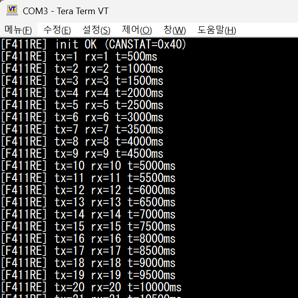

# multi-mcu-can: CAN 2.0 다중 MCU 분산 통신


STM32 보드 두 개를 중심으로 한 **CAN 2.0 노드 간 통신** 집중 학습 프로젝트. 액추에이터도, 섀시도, 애플리케이션 로직도 없다 — 버스와 프로토콜, 그리고 분산 MCU를 안정적으로 통신시키기 위해 필요한 규율에만 집중한다. F411RE는 bxCAN 페리퍼럴이 없어 **SPI(MCP2515)** 로 CAN 버스에 참여하며, SPI 제어도 이 프로젝트의 학습 범위에 포함된다.

이 저장소는 **[Neuro-Drive](https://github.com/steppenhj/neuro-drive)** 의 후속 프로젝트로, 원래 Phase 6에 해당하는 내용을 분리한 것이다. 액추에이터 레이어를 걷어내고 기초 및 CAN 통신에 집중하기 위해 별도 저장소로 추출했다.

> **현재 범위:** Phase 0–2 (STM32 ↔ STM32 2노드 CAN). Raspberry Pi 5 게이트웨이 노드는 Phase 3 이후로 연기되었으며, 현재 보류 상태다. 자세한 내용은 아래 [Phase 3 — 보류 사유](#phase-3--보류-사유) 참조.

---

## 별도 Repo를 만든 이유

부모 프로젝트에서 F446RE 마이그레이션 중 하드웨어 사고가 발생했다: 서보가 스톨(stall)했고, GND 점퍼 선에 불이 붙었으며, L298N 드라이버가 서보와 함께 망가졌다. 원인은 코드가 아니었다 — 하위 레이어를 변경한 후에도 이전에 정상 작동하던 하드웨어가 여전히 정상일 것이라는 가정이 문제였다.

이 저장소는 처음에 빠뜨렸던 규율을 중심으로 구성된다: **다음 레이어를 추가하기 전에 현재 레이어를 반드시 검증한다.**

---

## 운영 원칙

이 저장소의 모든 Phase에서 타협 불가능한 3가지 규칙.

1. **코드를 의심하기 전에 전원과 GND를 먼저 확인한다.** 멀티미터 점검은 30초면 된다; 보드가 타면 며칠이 날아간다.
2. **기대하는 동작 없이 비정상적인 소리나 열이 발생하면 즉시 전원을 차단한다.** 재인가 전에 원인을 파악한다. 스톨된 모터와 서보는 조용한 킬러다 — 조용하지 않게 되기 전까지는.
3. **한 번에 하나의 레이어만 추가한다.** 새로운 레이어 두 개를 동시에 디버깅하지 않는다. 버스가 새 것이라면 펌웨어는 검증된 것을 쓴다. 펌웨어가 새 것이라면 버스는 이미 검증된 상태여야 한다.

---

## 아키텍처

단일 CAN 2.0 버스에 두 노드, 500 kbps, 양쪽 물리적 끝단에 120Ω 종단 저항.

### Phase 2 목표 토폴로지

```
           [120Ω]                              [120Ω]
              │                                  │
  CAN_H ──────┼──────────────────────────────────┤
  CAN_L ──────┼──────────────────────────────────┤
              │                                  │
       ┌──────┴──────┐                    ┌──────┴──────┐
       │ SN65HVD230  │                    │   TJA1050   │
       │  (3.3V xcvr)│                    │(모듈 내장)  │
       └──────┬──────┘                    └──────┬──────┘
         TXD/RXD                            CAN TX/RX
              │                                  │
       ┌──────┴──────┐                    ┌──────┴──────┐
       │   F446RE    │                    │   MCP2515   │
       │   bxCAN     │                    │(SPI CAN ctrl│
       │  PA11/PA12  │                    │  외부 IC)   │
       └─────────────┘                    └──────┬──────┘
                                            SCK/MOSI/MISO/CS
                                                  │
                                          ┌───────┴─────┐
                                          │   F411RE    │
                                          │   SPI2      │
                                          │ PB13/14/15  │
                                          └─────────────┘
```

**노드 역할** (의도적으로 추상화 — 아직 액추에이터 없음):
- **F446RE** — 미래 MotorECU 자리 표시자. bxCAN + SN65HVD230 (3.3V 네이티브 트랜시버).
- **F411RE** — 미래 SensorECU 자리 표시자. MCP2515(SPI CAN 컨트롤러) + TJA1050(모듈 내장 트랜시버).

---

## Phase 계획

각 Phase는 **독립적으로 빌드 가능하고, 회귀 테스트가 가능한** 산출물을 만든다. 이후 Phase가 실패해도 이전 Phase를 실행할 수 있어야 한다.

### 현재 범위 (Phase 0–2)

| Phase | 목표 | 검증 방법 | 노드 수 |
|:-----:|------|-----------|:-------:|
| **0** | 전원 & GND 검증, 기본 동작 확인 | 멀티미터 측정값 기록, 각 보드에서 "I'm alive" UART 출력 | 2개 독립 |
| **1** | **F446RE** bxCAN 루프백 / **F411RE** MCP2515(SPI) 루프백 | TX/RX 카운터가 UART 모니터에서 동기적으로 증가 | 1 (각각) |
| **2** | F446RE ↔ F411RE 2노드 CAN | 양 노드의 하트비트(`0x010`, `0x011`)가 상호 수신, 카운터 동기 증가 | 2 |

### 보류 (Phase 3 이후)

| Phase | 목표 | 상태 |
|:-----:|------|------|
| **3** | RPi5 (SocketCAN) 게이트웨이 노드 추가 | **보류** — 하드웨어 호환성 솔루션 결정 필요 |
| **4** | 주기적 + 이벤트 기반 메시지 스케줄링, 우선순위 처리 | Phase 3 이후 |
| **5** | 오류 처리, 버스 오프 복구, 진단 교환 (UDS 스타일) | Phase 3 이후 |

### Phase 0를 별도로 두는 이유

부모 프로젝트의 사고는 정상 작동하는 차에서 시작해 서보 화재로 끝났다. 아무도 확인하지 않던 레이어를 통해 결함이 전파됐다. 이 저장소는 Phase 0 사인오프 전까지 Phase 1을 시작하지 않는다 — 모든 보드가 깨끗하게 전원이 들어오고, 모든 GND가 연속적이며, 모든 노드가 버스 도입 전에 UART로 "alive"를 출력해야 한다.

### Phase 2에서 트랜시버 선택의 중요성 (F446RE)

Phase 2에서 F446RE 측의 새 변수는 "물리 레이어" 단 하나여야 한다. STM32(3.3V 로직)와 호환되지 않는 5V 전용 트랜시버(MCP2551, TJA1050)를 F446RE에 직결하면 VIH 마진 부족으로 인한 **간헐적 송신 실패**라는 두 번째 변수가 추가된다. 이 저장소는 F446RE에 3.3V 네이티브 트랜시버인 **SN65HVD230**을 사용한다. 자세한 회고는 [`docs/lesson_learned.md`](docs/lesson_learned.md)의 "사전 회피" 섹션 참조.

**F411RE 측은 다른 이유로 다르다.** F411RE에는 bxCAN 페리퍼럴 자체가 없으므로, TXD/RXD 직결 문제가 발생하지 않는다. F411RE는 SPI를 통해 **MCP2515**를 제어하고, MCP2515 모듈에 내장된 **TJA1050**이 CAN 버스와 연결된다. SPI MISO 선(5V → 3.3V)은 F411RE의 5V 내성 핀(PB14)으로 처리한다.

### Phase 3 — 보류 사유

원래 계획은 RPi5를 MCP2515 + TJA1050 모듈로 SPI를 통해 버스에 연결하는 것이었다. 그러나 두 가지 호환성 문제가 확인되었다:

1. **TJA1050 트랜시버는 5V 전용**이며, 모듈 구조상 MCP2515 컨트롤러도 5V로 공급되어야 한다.
2. 이 경우 MCP2515의 SPI 출력이 5V 로직 레벨이 되어, RPi5의 3.3V 전용 GPIO에 직결하면 **GPIO 손상 위험**이 발생한다 (이전 사고로 RPi5 8GB 1대 손실 — `docs/lesson_learned.md` 사고 1 참조).

가능한 해결책은 (1) RPi 전용 CAN HAT (~25,000원, 가장 안전), (2) 로직 레벨 컨버터 추가, (3) MCP2515 모듈 SMD 리워크가 있으나, Phase 2 완료 시점에 재평가하기로 결정했다. 운영 원칙 #3 — "한 번에 하나의 새 레이어만 추가한다" — 에 부합하지 않는 시점에서 결정을 강행하지 않는다.

---

## CAN ID 할당

진단 ID에 대해 자동차 표준(UDS / ISO-15765) 관례를 차용.

### 현재 범위 (Phase 0–2)

| ID      | 송신자   | 목적                                   | 주기   | 우선순위 |
|---------|----------|----------------------------------------|--------|:--------:|
| `0x010` | F446RE   | 하트비트 (alive 카운터, 결함 플래그)   | 100ms  | 높음     |
| `0x011` | F411RE   | 하트비트                               | 100ms  | 높음     |
| `0x100` | F446RE   | 상태 (액추에이터 데이터 자리 표시자)   | 50ms   | 중간     |
| `0x200` | F411RE   | 센서 데이터 (자리 표시자)              | 50ms   | 중간     |

### 보류 (Phase 3 이후, RPi 도입 시)

| ID      | 송신자   | 목적                                   | 주기   |
|---------|----------|----------------------------------------|--------|
| `0x7E0` | RPi      | 진단 요청 (브로드캐스트)               | 이벤트 |
| `0x7E8` | F446RE   | 진단 응답                              | 이벤트 |
| `0x7E9` | F411RE   | 진단 응답                              | 이벤트 |

**낮은 CAN ID = 높은 우선순위** (CAN의 자연적 중재). 하트비트는 모든 것보다 우선하여, 버스가 혼잡해도 노드 생존 원격 측정이 지연되지 않도록 보장한다.

전체 메시지 사전: [`docs/specs/can_protocol.md`](docs/specs/can_protocol.md).

---

## 저장소 구조

```
multi-mcu-can/
├── README.md
├── docs/
│   ├── lesson_learned.md          # 부모 프로젝트 사고 회고 + 사전 회피 사례
│   ├── workflow.md                # 크로스 플랫폼(Ubuntu/Windows) 개발 워크플로
│   ├── phases/
│   │   ├── phase0/
│   │   │   ├── checklist.md       # 전원/GND 검증 절차
│   │   │   ├── ioc_f446re.md      # F446RE Phase 0 CubeMX 설정
│   │   │   └── ioc_f411re.md      # F411RE Phase 0 CubeMX 설정
│   │   └── phase1/
│   │       ├── checklist_f446re.md  # F446RE bxCAN 루프백 절차 + 완료 기록
│   │       ├── ioc_f446re.md        # F446RE Phase 1 CubeMX 설정
│   │       └── checklist_f411re.md  # F411RE MCP2515 SPI 루프백 + CubeMX 설정
│   └── specs/
│       ├── can_protocol.md        # 전체 메시지 사전, DLC, 바이트 순서
│       └── hardware.md            # 활성 BOM + 보류 부품
├── firmware/
│   ├── f446re_node/
│   │   ├── phase0_alive/          # LED 점멸 + UART "alive" (완료)
│   │   └── phase1_loopback/       # bxCAN 내부 루프백 (완료)
│   └── f411re_node/
│       ├── phase0_alive/          # LED 점멸 + UART "alive" (완료)
│       └── phase1_loopback/       # MCP2515 SPI 루프백 (완료)
└── rpi/                           # Phase 3 이후 (현재 보류)
```

각 Phase 폴더는 독립적으로 빌드 가능하다. Phase 2가 고장나도, Phase 1은 여전히 플래시하고 실행할 수 있다.

> Phase 3 이후 (RPi5 통합) 디렉토리는 보류 상태이며, Phase 2 완료 후 호환성 결정과 함께 추가될 예정이다.

---

## 하드웨어

| 구성 요소 | 부품 | 역할 |
|-----------|------|------|
| MCU 1 | STM32 NUCLEO-F446RE | bxCAN 노드 1, 미래 MotorECU |
| MCU 2 | STM32 NUCLEO-F411RE | MCP2515(SPI) 노드 2, 미래 SensorECU |
| F446RE 트랜시버 | **SN65HVD230 모듈** | 3.3V 네이티브 차동 물리 레이어 |
| F411RE CAN 컨트롤러 + 트랜시버 | **MCP2515 + TJA1050 모듈** | SPI CAN 컨트롤러 + 5V 트랜시버(모듈 내장) |
| 종단 저항 | 120Ω × 2 | 버스 양쪽 물리적 끝단 |
| 전원 | USB만 (벤치 전원, 배터리 없음) | Phase 0–2 모두 데스크 전원으로 작동 |

**왜 F446RE에 SN65HVD230인가:** F446RE는 3.3V 로직 MCU다. 5V 전용 트랜시버(MCP2551, TJA1050)를 직결하면 TXD 입력의 VIH 임계값(~3.5V)이 3.3V 출력 마진을 초과하지 못해 간헐적 송신 실패를 일으킨다. SN65HVD230은 3.3V 네이티브 트랜시버다.

**왜 F411RE에 MCP2515인가:** F411RE에는 bxCAN 페리퍼럴이 없다. MCP2515는 SPI를 통해 제어하는 외부 CAN 컨트롤러로, F411RE의 유일한 CAN 참여 경로다. 모듈에 내장된 TJA1050(5V) 트랜시버는 CAN 버스 쪽에만 연결되며, SPI MISO 선(5V → F411RE)은 PB14의 5V 내성으로 처리한다.

### F411RE(3.3V) ↔ MCP2515(5V) 전압 호환성

MCP2515 모듈은 5V로 공급되지만, F411RE(3.3V)와 레벨 컨버터 없이 직결이 가능하다. 방향별 이유는 다르다.

| 신호 방향 | 전압 | 동작 이유 |
|-----------|------|-----------|
| F411RE → MCP2515 (MOSI, SCK, CS) | 3.3V → 5V 모듈 | MCP2515 TXD 입력의 VIH ≈ 2.1V. F411RE 출력 3.3V가 충분히 HIGH로 인식됨 |
| MCP2515 → F411RE (MISO) | 5V → 3.3V MCU | PB14는 STM32F411RE 데이터시트 Table 11에서 **FT(Five-volt Tolerant)** 핀으로 분류. 5V 신호를 직접 수신 가능 |

> **RPi5와 다른 이유:** RPi5 GPIO는 5V 내성이 없다. 동일한 MCP2515 모듈(MISO 5V)을 RPi5에 직결하면 GPIO 손상 위험이 있어 Phase 3를 보류한 원인 중 하나다 — [lesson_learned.md](docs/lesson_learned.md) 사전 회피 1 참조.

**이 저장소에서는 배터리를 사용하지 않는다.** 부모 프로젝트의 사고는 배터리 배선과 관련이 있었다. 이 저장소는 USB 전원만 사용한다.

> **Phase 3 이후 (RPi5 통합)** — MCP2515 + TJA1050 모듈을 RPi5에 직결하면 MISO 5V 출력이 3.3V 전용 GPIO를 손상시킬 위험이 있다. RPi5 연결 방식은 Phase 2 완료 후 별도 결정한다.

전체 BOM 및 배선: [`docs/specs/hardware.md`](docs/specs/hardware.md).

---

## 시작하기

### 사전 요구 사항
- STM32CubeIDE
- 호스트 PC의 UART 시리얼 모니터 (CubeIDE 내장 또는 PuTTY/screen 등)

### Phase 0 — 초기 시동

```bash
# 각 보드에 phase0_alive 펌웨어 플래시:
#   - LED가 1Hz로 점멸
#   - UART로 "[F446RE] alive, t=12345ms"를 1초마다 출력
#   - F411RE도 동일 패턴 ("[F411RE] alive, t=...")

# 다음 단계로 넘어가기 전에 각 보드의 UART 출력을 독립적으로 확인
```

멀티미터/연속성 확인 절차는 [`docs/phases/phase0/checklist.md`](docs/phases/phase0/checklist.md) 참조.
F446RE CubeMX 설정: [`docs/phases/phase0/ioc_f446re.md`](docs/phases/phase0/ioc_f446re.md)
F411RE CubeMX 설정: [`docs/phases/phase0/ioc_f411re.md`](docs/phases/phase0/ioc_f411re.md)

### Phase 1 — 각 노드 CAN 루프백 검증

```bash
# F446RE: phase1_loopback 플래시 → UART에서 tx/rx 카운터 동기 증가 확인 (완료)
# F411RE: phase1_loopback 플래시 (MCP2515 SPI 루프백)
#   배선: F411RE SPI2(PB13/14/15) ↔ MCP2515 모듈 + PB6=CS
#   UART에서 "init OK (CANSTAT=0x40)" 후 tx/rx 카운터 동기 증가 확인
```

F446RE 절차: [`docs/phases/phase1/checklist_f446re.md`](docs/phases/phase1/checklist_f446re.md)
F411RE 절차: [`docs/phases/phase1/checklist_f411re.md`](docs/phases/phase1/checklist_f411re.md)




### Phase 2 — 2노드 CAN 통신

```bash
# 양쪽 보드에 phase2_two_node 펌웨어 플래시
# 배선: F446RE PA11/PA12 ↔ SN65HVD230 ↔ CAN 버스 ↔ TJA1050 ↔ MCP2515 ↔ F411RE SPI2(PB13/14/15)
# 공통 GND 필수 (phase0_checklist.md Step 2)

# 각 노드의 UART에서 상대방의 하트비트 수신 카운터가 동기 증가하는지 확인
```

---

## 로드맵 (Phase 2 이후)

2노드 버스가 완전히 안정화된 후 가능한 확장:

- **Phase 3:** RPi5 게이트웨이 노드 추가 (호환성 솔루션 결정 필요 — CAN HAT, USB-CAN 어댑터, 또는 로직 레벨 컨버터 중 택)
- **Phase 4:** 주기적 + 이벤트 기반 메시지 스케줄링, 우선순위 처리
- **Phase 5:** 오류 처리, 버스 오프 복구, 진단 교환 (UDS 스타일)
- **CAN-FD** 마이그레이션 (F446RE는 지원하지만 F411RE는 지원 안 함 — 노드 교체 필요)
- **ISO-TP** (ISO-15765-2) 진단 페이로드 > 8바이트 분할 메시지
- **UDS** 서비스 구현 (DTC 읽기, ECU 초기화, 프로그래밍 세션)
- 액추에이터 레이어 재구성 후 부모 **Neuro-Drive** 섀시와 재통합

---

## 작성자

**박해진 (Haejin Park)**  
경북대학교