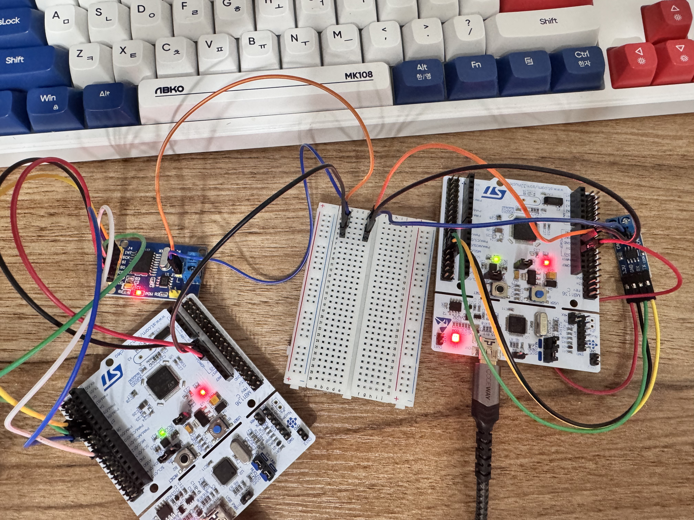

# multi-mcu-can: CAN 2.0 다중 MCU 분산 통신


STM32 보드 두 개로 CAN 2.0 노드 간 통신을 공부한 프로젝트다. 모터도 섀시도 애플리케이션 로직도 없다. 버스랑 프로토콜, 그리고 분산된 MCU를 안정적으로 통신시키는 데 필요한 것만 다뤘다. F411RE는 bxCAN 페리퍼럴이 없어서 SPI로 MCP2515를 붙여 버스에 참여시켰고, 그 SPI 제어까지가 이 프로젝트 범위다.

원래 [Neuro-Drive](https://github.com/steppenhj/neuro-drive)의 Phase 6이었는데, 액추에이터를 다 걷어내고 CAN 통신만 보려고 따로 떼어냈다.

펌웨어는 STM32CubeIDE에서 작성·빌드·디버깅하고, 검증 끝난 `.ioc`랑 핵심 소스(`main.c`, `can.c` 등)만 여기 복사해서 보관한다. 문서(`.md`)는 여기서 직접 쓴다. 그러니까 이 repo는 개발 환경이 아니라 CubeIDE에서 검증한 펌웨어 스냅샷 + 문서 보관소다.

현재 범위는 Phase 0–2 (STM32 ↔ STM32 2노드 CAN)다. Raspberry Pi 5 게이트웨이 노드(Phase 3)는 호환성 문제로 보류 중이다. 사유는 아래 [Phase 3 — 보류 사유](#phase-3--보류-사유) 참조.


Phase 2 배선 완료 상태. 좌측이 F411RE + MCP2515(SPI CAN), 우측이 F446RE + SN65HVD230(3.3V 트랜시버). 중앙 브레드보드가 CAN_H / CAN_L / GND 공통 허브다.

---

## 왜 따로 repo를 팠나

부모 프로젝트에서 F446RE로 마이그레이션하다가 하드웨어 사고가 났다. 서보가 스톨됐고, GND 점퍼 선에 불이 붙었고, L298N 드라이버가 서보랑 같이 망가졌다. 코드 문제가 아니었다. 하위 레이어를 바꿔놓고도 전에 잘 돌던 하드웨어는 그대로 멀쩡할 거라고 가정한 게 문제였다.

그때 빠뜨렸던 규율 하나를 중심으로 이 repo를 다시 짰다. 다음 레이어를 올리기 전에 지금 레이어를 먼저 검증한다.

---

## 운영 원칙

모든 Phase에 공통으로 지키는 규칙 세 가지.

1. 코드를 의심하기 전에 전원이랑 GND부터 본다. 멀티미터로 확인하는 건 30초지만, 보드가 타면 그날치 작업은 날아간다.
2. 기대한 동작 없이 이상한 소리나 열이 나면 바로 전원을 끊는다. 원인을 찾기 전엔 다시 넣지 않는다. 스톨된 모터는 소리 나기 전까지 조용하다.
3. 한 번에 레이어 하나만 추가한다. 버스가 새 거면 펌웨어는 검증된 걸 쓰고, 펌웨어가 새 거면 버스는 이미 검증돼 있어야 한다.

---

## 아키텍처

CAN 2.0 버스 하나에 노드 둘, 500 kbps, 양쪽 물리적 끝단에 120Ω 종단 저항.

### Phase 2 목표 토폴로지

```
           [120Ω]                              [120Ω]
              │                                  │
  CAN_H ──────┼──────────────────────────────────┤
  CAN_L ──────┼──────────────────────────────────┤
              │                                  │
       ┌──────┴──────┐                    ┌──────┴──────┐
       │ SN65HVD230  │                    │   TJA1050   │
       │  (3.3V xcvr)│                    │(모듈 내장)  │
       └──────┬──────┘                    └──────┬──────┘
         TXD/RXD                            CAN TX/RX
              │                                  │
       ┌──────┴──────┐                    ┌──────┴──────┐
       │   F446RE    │                    │   MCP2515   │
       │   bxCAN     │                    │(SPI CAN ctrl│
       │  PA11/PA12  │                    │  외부 IC)   │
       └─────────────┘                    └──────┬──────┘
                                            SCK/MOSI/MISO/CS
                                                  │
                                          ┌───────┴─────┐
                                          │   F411RE    │
                                          │   SPI2      │
                                          │ PB13/14/15  │
                                          └─────────────┘
```

노드 역할은 아직 액추에이터가 없어서 자리만 잡아뒀다.

- F446RE — 나중에 MotorECU 자리. bxCAN + SN65HVD230(3.3V 네이티브 트랜시버).
- F411RE — 나중에 SensorECU 자리. MCP2515(SPI CAN 컨트롤러) + TJA1050(모듈 내장 트랜시버).

---

## Phase 계획

각 Phase는 독립적으로 빌드되고 회귀 테스트가 되는 산출물을 만든다. 뒤 Phase가 깨져도 앞 Phase는 돌아가야 한다.

### 현재 범위 (Phase 0–2)

| Phase | 목표 | 검증 방법 | 노드 수 |
|:-----:|------|-----------|:-------:|
| **0** | 전원 & GND 검증, 기본 동작 확인 | 멀티미터 측정값 기록, 각 보드에서 "alive" UART 출력 | 2개 독립 |
| **1** | F446RE bxCAN 루프백 / F411RE MCP2515(SPI) 루프백 | TX/RX 카운터가 UART에서 동기 증가 | 1 (각각) |
| **2** | F446RE ↔ F411RE 2노드 CAN | 양 노드 하트비트(`0x010`, `0x011`) 상호 수신, 카운터 동기 증가 | 2 |

Phase 0를 따로 떼어 둔 건, 위 사고가 아무도 안 보던 레이어를 타고 번졌기 때문이다. 모든 보드가 깨끗하게 전원 들어오고, GND가 연속이고, 버스 붙이기 전에 UART로 "alive"가 찍히는 걸 확인하기 전엔 Phase 1을 시작하지 않는다.

### 보류 (Phase 3 이후)

| Phase | 목표 | 상태 |
|:-----:|------|------|
| **3** | RPi5 (SocketCAN) 게이트웨이 노드 추가 | 보류 — 호환성 솔루션 결정 필요 |
| **4** | 주기적 + 이벤트 기반 메시지 스케줄링, 우선순위 처리 | Phase 3 이후 |
| **5** | 오류 처리, 버스 오프 복구, 진단 교환 (UDS 스타일) | Phase 3 이후 |

### Phase 3 — 보류 사유

원래는 RPi5를 MCP2515 + TJA1050 모듈로 SPI를 통해 버스에 붙이려고 했는데, 두 가지가 걸렸다.

1. TJA1050 트랜시버가 5V 전용이고, 모듈 구조상 MCP2515 컨트롤러도 5V로 공급해야 한다.
2. 그러면 MCP2515의 SPI 출력이 5V 로직이 되는데, RPi5 GPIO는 3.3V 전용이라 직결하면 손상될 수 있다. (이전에 이걸로 RPi5 8GB 한 대를 날렸다 — `docs/lesson_learned.md` 사고 1.)

해결책은 RPi 전용 CAN HAT(~25,000원, 제일 안전), 로직 레벨 컨버터, MCP2515 모듈 SMD 리워크 정도가 있는데, Phase 2 끝나고 다시 보기로 했다. 운영 원칙 #3에 어긋나는 시점에서 무리하게 결정하지 않는다.

---

## CAN ID 할당

진단 ID는 자동차 표준(UDS / ISO-15765) 관례를 따랐다.

### 현재 범위 (Phase 0–2)

| ID      | 송신자   | 목적                                   | 주기   | 우선순위 |
|---------|----------|----------------------------------------|--------|:--------:|
| `0x010` | F446RE   | 하트비트 (alive 카운터, 결함 플래그)   | 100ms  | 높음     |
| `0x011` | F411RE   | 하트비트                               | 100ms  | 높음     |
| `0x100` | F446RE   | 상태 (액추에이터 데이터 자리)          | 50ms   | 중간     |
| `0x200` | F411RE   | 센서 데이터 (자리)                     | 50ms   | 중간     |

### 보류 (Phase 3 이후, RPi 도입 시)

| ID      | 송신자   | 목적                     | 주기   |
|---------|----------|--------------------------|--------|
| `0x7E0` | RPi      | 진단 요청 (브로드캐스트) | 이벤트 |
| `0x7E8` | F446RE   | 진단 응답                | 이벤트 |
| `0x7E9` | F411RE   | 진단 응답                | 이벤트 |

CAN은 낮은 ID가 높은 우선순위로 중재된다. 하트비트를 제일 낮은 ID에 둬서, 버스가 붐벼도 노드 생존 신호가 밀리지 않게 했다.

전체 메시지 사전: [`docs/specs/can_protocol.md`](docs/specs/can_protocol.md).

---

## 저장소 구조

```
multi-mcu-can/
├── README.md
├── docs/
│   ├── lesson_learned.md          # 부모 프로젝트 사고 회고 + 사전 회피 사례
│   ├── workflow.md                # 크로스 플랫폼(Ubuntu/Windows) 개발 워크플로
│   ├── phases/
│   │   ├── phase0/
│   │   │   ├── checklist.md       # 전원/GND 검증 절차
│   │   │   ├── ioc_f446re.md      # F446RE Phase 0 CubeMX 설정
│   │   │   └── ioc_f411re.md      # F411RE Phase 0 CubeMX 설정
│   │   └── phase1/
│   │       ├── checklist_f446re.md  # F446RE bxCAN 루프백 절차 + 완료 기록
│   │       ├── ioc_f446re.md        # F446RE Phase 1 CubeMX 설정
│   │       └── checklist_f411re.md  # F411RE MCP2515 SPI 루프백 + CubeMX 설정
│   └── specs/
│       ├── can_protocol.md        # 전체 메시지 사전, DLC, 바이트 순서
│       └── hardware.md            # 활성 BOM + 보류 부품
├── firmware/
│   ├── f446re_node/
│   │   ├── phase0_alive/          # LED 점멸 + UART "alive" (완료)
│   │   └── phase1_loopback/       # bxCAN 내부 루프백 (완료)
│   └── f411re_node/
│       ├── phase0_alive/          # LED 점멸 + UART "alive" (완료)
│       └── phase1_loopback/       # MCP2515 SPI 루프백 (완료)
└── rpi/                           # Phase 3 이후 (현재 보류)
```

Phase 2가 깨져도 Phase 1은 그대로 플래시해서 돌릴 수 있다.

---

## 하드웨어

| 구성 요소 | 부품 | 역할 |
|-----------|------|------|
| MCU 1 | STM32 NUCLEO-F446RE | bxCAN 노드 1, 미래 MotorECU |
| MCU 2 | STM32 NUCLEO-F411RE | MCP2515(SPI) 노드 2, 미래 SensorECU |
| F446RE 트랜시버 | SN65HVD230 모듈 | 3.3V 네이티브 차동 물리 레이어 |
| F411RE CAN 컨트롤러 + 트랜시버 | MCP2515 + TJA1050 모듈 | SPI CAN 컨트롤러 + 5V 트랜시버(모듈 내장) |
| 종단 저항 | 120Ω × 2 | 버스 양쪽 물리적 끝단 |
| 전원 | USB만 (벤치 전원, 배터리 없음) | Phase 0–2 모두 데스크 전원 |

F446RE에 SN65HVD230을 쓴 이유: F446RE는 3.3V 로직 MCU다. 5V 전용 트랜시버(MCP2551, TJA1050)를 직결하면 TXD 입력의 VIH 임계값(~3.5V)을 3.3V 출력이 못 넘겨서 간헐적으로 송신이 실패한다. SN65HVD230은 3.3V 네이티브라 이 문제가 없다. Phase 2에서 F446RE 측에 새로 추가되는 변수를 물리 레이어 하나로 묶기 위한 선택이기도 하다.

F411RE에 MCP2515를 쓴 이유: F411RE에는 bxCAN이 없다. MCP2515가 SPI로 제어하는 외부 CAN 컨트롤러라, F411RE가 CAN에 참여할 유일한 경로다. 모듈에 내장된 TJA1050(5V)은 CAN 버스 쪽에만 붙고, SPI MISO 선(5V → F411RE)은 PB14의 5V 내성으로 받는다.

### F411RE(3.3V) ↔ MCP2515(5V) 전압 호환성

MCP2515 모듈은 5V로 공급하지만 F411RE(3.3V)와 레벨 컨버터 없이 직결된다. 방향별로 이유가 다르다.

| 신호 방향 | 전압 | 동작 이유 |
|-----------|------|-----------|
| F411RE → MCP2515 (MOSI, SCK, CS) | 3.3V → 5V 모듈 | MCP2515 입력 VIH ≈ 2.1V. F411RE의 3.3V 출력이면 충분히 HIGH로 인식 |
| MCP2515 → F411RE (MISO) | 5V → 3.3V MCU | PB14는 F411RE 데이터시트 Table 11에서 FT(5V 내성) 핀. 5V를 직접 받아도 됨 |

같은 모듈을 RPi5에 직결하지 못하는 게 이 MISO 5V 때문이다. RPi5 GPIO는 5V 내성이 없어서 Phase 3를 보류했다.

부모 프로젝트 사고가 배터리 배선과 얽혀 있어서, 이 repo는 배터리 없이 USB 전원만 쓴다.

전체 BOM 및 배선: [`docs/specs/hardware.md`](docs/specs/hardware.md).

---

## 시작하기

### 사전 요구 사항
- STM32CubeIDE
- 호스트 PC의 UART 시리얼 모니터 (CubeIDE 내장 또는 PuTTY/screen 등)

### Phase 0 — 초기 시동

```bash
# 각 보드에 phase0_alive 펌웨어 플래시:
#   - LED 1Hz 점멸
#   - UART로 "[F446RE] alive, t=12345ms" 1초마다 출력 (F411RE도 동일 패턴)
# 다음 단계 전에 각 보드 UART 출력을 독립적으로 확인
```

멀티미터/연속성 절차: [`docs/phases/phase0/checklist.md`](docs/phases/phase0/checklist.md)
F446RE CubeMX 설정: [`docs/phases/phase0/ioc_f446re.md`](docs/phases/phase0/ioc_f446re.md)
F411RE CubeMX 설정: [`docs/phases/phase0/ioc_f411re.md`](docs/phases/phase0/ioc_f411re.md)

### Phase 1 — 각 노드 CAN 루프백 검증

```bash
# F446RE: phase1_loopback 플래시 → UART에서 tx/rx 카운터 동기 증가 (완료)
# F411RE: phase1_loopback 플래시 (MCP2515 SPI 루프백)
#   배선: F411RE SPI2(PB13/14/15) ↔ MCP2515 모듈 + PB6=CS
#   UART에서 "init OK (CANSTAT=0x40)" 후 tx/rx 카운터 동기 증가 확인
```

F446RE 절차: [`docs/phases/phase1/checklist_f446re.md`](docs/phases/phase1/checklist_f446re.md)
F411RE 절차: [`docs/phases/phase1/checklist_f411re.md`](docs/phases/phase1/checklist_f411re.md)


### Phase 2 — 2노드 CAN 통신

```bash
# 양쪽 보드에 phase2_two_node 펌웨어 플래시
# 배선: F446RE PA11/PA12 ↔ SN65HVD230 ↔ CAN 버스 ↔ TJA1050 ↔ MCP2515 ↔ F411RE SPI2(PB13/14/15)
# 공통 GND 필수 (phase0/checklist.md Step 2)
# 각 노드 UART에서 상대 하트비트 수신 카운터가 동기 증가하는지 확인
```

Phase 2 배선 절차: [`docs/phases/phase2/checklist.md`](docs/phases/phase2/checklist.md)

**결과 — 양방향 500 kbps 통신 검증 완료.** 두 노드가 물리 CAN 버스를 통해 서로의 하트비트(F446RE `0x010` ↔ F411RE `0x011`)를 수신하며, 양쪽 `peer_rx`가 `self_tx`와 동기 증가한다. F446RE `err=0x0`, F411RE `eflg=0x00` (에러 플래그 없음) 유지.

```
[F411RE] init OK (CANSTAT=0x00)
[F411RE] self_tx=479 peer_rx=478 eflg=0x00 t=47900ms
[F446RE] CAN start: state=2 err=0x0
[F446RE] self_tx=10  peer_rx=11  err=0x0  t=1000ms
```

F411RE `CANSTAT=0x00`(Normal 모드 진입) 확인, F446RE `state=2`(HAL_CAN_STATE_READY) 확인.




실시간 동작 영상: [`docs/assets/captures/Phase2_CAN.mp4`](docs/assets/captures/Phase2_CAN.mp4)

---

## 로드맵 (Phase 2 이후)

2노드 버스가 충분히 안정된 다음 생각하는 확장.

- Phase 3: RPi5 게이트웨이 노드 추가 (CAN HAT / USB-CAN 어댑터 / 로직 레벨 컨버터 중 택)
- Phase 4: 주기적 + 이벤트 기반 메시지 스케줄링, 우선순위 처리
- Phase 5: 오류 처리, 버스 오프 복구, 진단 교환 (UDS 스타일)
- CAN-FD 마이그레이션 (F446RE는 되지만 F411RE는 안 됨 — 노드 교체 필요)
- ISO-TP (ISO-15765-2)로 8바이트 넘는 진단 페이로드 분할
- UDS 서비스 구현 (DTC 읽기, ECU 초기화, 프로그래밍 세션)
- 액추에이터 레이어 다시 올려서 부모 Neuro-Drive 섀시와 재통합

---

## 작성자

박해진 (Haejin Park)
경북대학교
