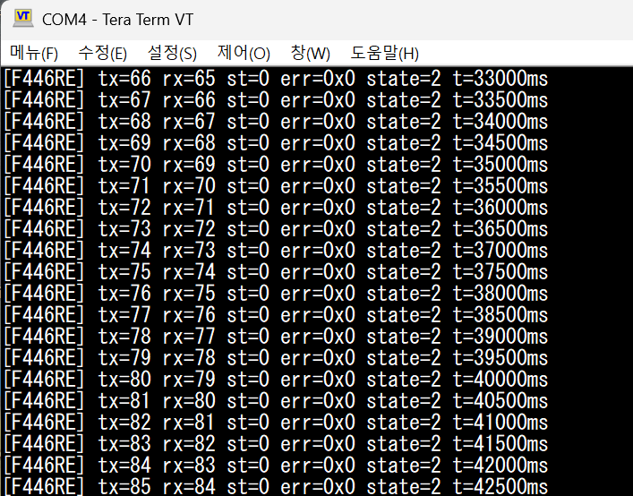

# Phase 1 — bxCAN Loopback Verification Log



## 결과

- **2026-05-12**: F446RE LOOPBACK 모드에서 tx/rx 동기 증가 확인.
- 비트레이트 **500 kbps**, Prescaler=9, BS1=8 TQ, BS2=1 TQ, SJW=1 TQ → 샘플 포인트 90%.
- LD2 1Hz 점멸 + USART2(115200) "alive + tx/rx 카운터" 출력 동시 동작.
- CAN 에러 레지스터 = 0x0 (지속 클린).
- Phase 1 정의 (README 표) — "TX/RX 카운터가 UART 모니터에서 동기적으로 증가" — 충족.

### 관찰: rx가 tx보다 항상 1 뒤처지는 이유

루프 구조가 `TX → RX 폴링` 순서라, 첫 사이클에서는 송신만 하고 RX FIFO에는 아직 아무 것도 없음. 다음 사이클부터 직전 사이클의 프레임이 FIFO에서 빠짐. 그래서 정상 동작 시 `tx - rx = 1`이 유지됨. 이건 페리퍼럴이 아니라 폴링 타이밍의 결과.

---

## 최종 설정 요약

| 항목 | 값 | 위치 |
|------|-----|------|
| Operating Mode | Loopback | `.ioc` → CAN1 Parameter Settings |
| Prescaler | 9 | `.ioc` |
| Time Quanta in BS1 | 8 TQ | `.ioc` |
| Time Quanta in BS2 | 1 TQ | `.ioc` |
| SJW | 1 TQ | `.ioc` |
| AutoRetransmission | DISABLE | `.ioc` |
| 필터 0 | Catch-all (Mask=0, ID=0), FIFO0 | `main.c` USER CODE 2 |
| PA11 (CAN_RX) Pull | **PULLUP** | `can.c` `HAL_CAN_MspInit` USER CODE 1 |
| PA12 (CAN_TX) Pull | NOPULL | `can.c` (CubeMX 기본값) |

비트레이트 검산: APB1 = 45 MHz, TQ 총합 = 1 + 8 + 1 = 10, Prescaler = 9 → 45,000,000 / (9 × 10) = **500,000 bps**.

---

## 디버깅 중 마주친 함정

### 1. CubeMX GUI는 AF 핀의 Pull 설정을 받지 않는다

- **증상**: `.ioc`에서 PA11의 Pull-up/Pull-down 드롭다운을 바꿔도 재생성된 `HAL_CAN_MspInit` 안에서 `GPIO_InitStruct.Pull = GPIO_NOPULL` 그대로.
- **원인**: CubeMX는 AF(Alternate Function) 모드 핀에 대해 "페리퍼럴이 핀을 제어하므로 Pull 설정은 의미 없다"고 판단해 GUI 입력을 무시한다. STM32 HW의 한계가 아니라 CubeMX의 정책.
- **해결**: 해당 페리퍼럴의 `HAL_..._MspInit` 안의 USER CODE 블록에서 `HAL_GPIO_Init`을 한 번 더 호출해 Pull만 덮어쓴다. 재생성에서 살아남고, CAN 관련 파일 안에 응집되어 보존된다.
- **참고**: USART_RX 등 다른 AF 핀에도 동일한 제약이 있을 가능성 높음.

### 2. HAL_CAN_Start 타임아웃과 RX 핀 floating

- **증상**: `HAL_CAN_Start` 반환값 = 1 (HAL_ERROR), state = 5 (HAL_CAN_STATE_ERROR), err = 0x20000 (HAL_CAN_ERROR_NOT_INITIALIZED).
- **원인**: bxCAN이 Initialization → Normal mode로 전환하려면 INAK 비트 클리어가 필요하고, 이건 **버스에서 11개 연속 recessive(high) 비트 감지**가 조건. LOOPBACK 모드라도 이 단계는 RX 핀의 물리적 레벨을 본다. RX 핀이 floating이면 11 recessive 감지 실패 → 타임아웃.
- **해결**: PA11에 풀업 적용 (위 함정 1과 연결됨).
- **잘못된 직관**: "LOOPBACK은 내부 경로만 쓰니 RX 핀 상태와 무관하다" — 틀림. 송수신 경로는 내부지만 모드 전환 단계는 RX 핀을 본다.

### 3. 비트 타이밍 BS1=1, BS2=1은 에러 없이도 RX 실패한다

- **증상**: `tx_count`는 정상 증가, `err = 0x0`, `state = 2` (LISTENING) 클린, 그런데 `rx_count = 0` 유지.
- **이전 설정**: Prescaler=16, BS1=1, BS2=1 → 한 비트 = 3 TQ, 비트레이트 937.5 kbps, 샘플 포인트 66.7%.
- **원인 추정**: 3 TQ는 STM32F4 Reference Manual의 일반 권장(8~25 TQ) 밖이라 내부 RX 경로에서도 비트 재구성이 불안정. 에러 카운터가 잡히지 않은 이유는 LOOPBACK이라 외부 비트와의 비교 자체가 없기 때문.
- **해결**: BS1=8, BS2=1로 변경 → 한 비트 = 10 TQ, 샘플 포인트 90%. rx_count가 비로소 증가 시작.

### 4. CubeMX의 파라미터 회귀

- **증상**: 비트 타이밍만 바꾸려고 `.ioc`를 수정했는데, 재생성된 `can.c`에서 `Mode = CAN_MODE_NORMAL`로 돌아가 있음. 직전 단계에서는 LOOPBACK이었음.
- **원인**: CubeMX가 같은 페리퍼럴의 한 파라미터를 변경할 때 다른 파라미터를 기본값으로 리셋하는 경우가 가끔 있다. 알려진 거동.
- **해결**: `.ioc` 수정 후 항상 코드 측에서 변경 의도와 일치하는지 확인. 단 한 줄만 바꾸려 했어도 두 줄 이상 바뀌었을 가능성을 항상 의심.
- **이번 케이스의 교훈**: 운영 원칙 #3 — "한 번에 하나의 레이어만 추가한다" — 의 정신을 지키려면, 한 번에 한 파라미터만 바꾼 뒤 코드 diff를 봐야 한다. 모드와 비트 타이밍이 동시에 바뀌면 결과가 좋아도 무엇 덕분인지 모른다.

### 5. 풀업 코드의 위치 — main.c vs MspInit

- **시도 1**: `main.c`의 `/* USER CODE BEGIN 2 */`에 PA11 풀업 강제 코드 배치 → 동작은 하지만 응집도 나쁨, "왜 main에서 GPIO를 만지지?" 의문 발생.
- **시도 2**: `can.c`의 `HAL_CAN_MspInit` USER CODE 1 블록으로 이동 → CAN 관련 설정이 한 파일에 모임, 재생성 보존, Phase 2 진입 시 트랜시버 연결되면 한 블록만 비우면 됨.
- **결론**: 페리퍼럴 종속 GPIO 보정은 해당 페리퍼럴의 MspInit 안이 정답.

---

## 진단 절차 (다음에 비슷한 증상 보면 이 순서로)

`HAL_CAN_Start` 또는 RX 폴링이 의심될 때, UART로 다음 다섯 가지를 찍어보는 게 가장 빠른 진단 경로:

```c[FILTER]     status = HAL_CAN_ConfigFilter 반환값
[PRE-START]  state, err  (Start 직전)
[POST-START] state, err  (Start 직후)
[루프]       tx_status, err, state  (매 사이클)

이번 디버깅에서 단계마다 결정적인 단서가 나왔던 곳:

| 출력 | 값 | 의미 |
|------|-----|------|
| `[POST-START] start=1 err=0x20000` | HAL_ERROR + NOT_INITIALIZED | INAK 클리어 실패 → RX 핀 floating 의심 |
| `[POST-START] start=0 state=2 err=0x0` 인데 rx=0 | 페리퍼럴은 OK | 비트 타이밍 의심 |
| `err=0x60000` (0x20000 + 0x40000) | NOT_INITIALIZED + NOT_STARTED | Start 실패 후 누적되는 패턴 |

---

## Phase 1 sign-off 체크리스트

- [x] LOOPBACK 모드에서 tx/rx 동기 증가 확인 (Tera Term 캡쳐 첨부).
- [x] 500 kbps 비트 타이밍 (Phase 2 목표값과 일치) 적용 및 검증.
- [x] CAN 에러 레지스터 클린 상태 유지.
- [x] LD2 점멸과 UART 출력 동시 동작 (Phase 0 회귀 없음).
- [x] 풀업 워크어라운드를 `HAL_CAN_MspInit` USER CODE에 배치 (재생성 보존).
- [x] 본 로그 작성 및 커밋.

다음 Phase 진입 가능.